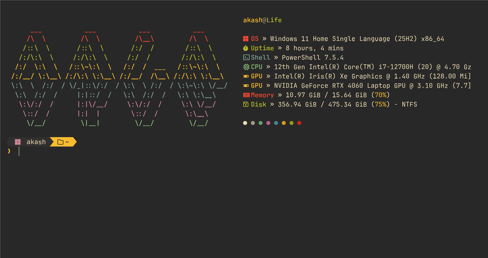

# Windows Terminal Configuration

A clean and modern Windows Terminal setup for a beautiful and productive CLI experience, heavily inspired by the Gruvbox aesthetic.



## Features

-  Custom Gruvbox-style Oh My Posh theme (`gruvbox-slick.omp.json`)
-  Fast directory navigation with Zoxide
-  Colorful file icons with Terminal-Icons
-  System info display with Fastfetch (custom Gruvbox config)
-  Advanced WezTerm configuration with GPU acceleration and custom styling
-  Nerd Font support for enhanced visuals

## What's Included

```
windows-terminal-config/
├── .wezterm.lua                      # WezTerm config
├── Microsoft.PowerShell_profile.ps1  # PowerShell config
├── settings.json                     # Windows Terminal settings
├── assets/                           # Project assets (screenshots, etc.)
├── fastfetch/                        # Fastfetch configuration files
│   ├── ascii.txt
│   └── config.jsonc
└── oh-my-posh/                       # Oh My Posh themes
    └── gruvbox-slick.omp.json
```

## Prerequisites

- [PowerShell 7+](https://github.com/PowerShell/PowerShell)
- [Windows Terminal](https://aka.ms/terminal)
- [Oh My Posh](https://ohmyposh.dev/docs/installation)
- [Zoxide](https://github.com/ajeetdsouza/zoxide)
- [Terminal-Icons](https://github.com/devblackops/Terminal-Icons)
- [Fastfetch](https://github.com/fastfetch-cli/fastfetch)
- [JetBrainsMono Nerd Font](https://www.nerdfonts.com/font-downloads) (recommended)
- [WezTerm](https://wezfurlong.org/wezterm/install/) (optional)

## Installation

### 1. Clone the Repository

```powershell
git clone https://github.com/lazy-blake/windows-terminal-config.git
cd windows-terminal-config
```

### 2. Install Dependencies

```powershell
# Install Oh My Posh
winget install JanDeDobbeleer.OhMyPosh

# Install Zoxide
winget install ajeetdsouza.zoxide

# Install Terminal-Icons
Install-Module -Name Terminal-Icons -Repository PSGallery

# Install Fastfetch
winget install Fastfetch-cli.Fastfetch
```

### 3. Set Up PowerShell Profile

Copy the PowerShell profile to your profile location:

```powershell
# Check your profile path
$PROFILE

# Copy the profile
Copy-Item Microsoft.PowerShell_profile.ps1 $PROFILE
```

### 4. Set Up Configurations

Move the configuration files to their respective locations:

```powershell
# Fastfetch
New-Item -ItemType Directory -Path "$HOME\.config\fastfetch" -Force
Copy-Item fastfetch\* "$HOME\.config\fastfetch\" -Recurse

# Oh My Posh
New-Item -ItemType Directory -Path "$HOME\.config\oh-my-posh" -Force
Copy-Item oh-my-posh\* "$HOME\.config\oh-my-posh\" -Recurse

# WezTerm (Optional)
Copy-Item .wezterm.lua "$HOME\.wezterm.lua"
```

### 5. Install Nerd Font

Download and install [JetBrainsMono Nerd Font](https://www.nerdfonts.com/font-downloads), then set it as your terminal font in Windows Terminal or WezTerm settings.

## Usage

After installation, restart your terminal. You should see:

- Fastfetch system information on startup
- A custom Gruvbox-themed Oh My Posh prompt
- Colorful file icons when listing directories
- Fast directory jumping with `z` command

## Troubleshooting

If scripts don't run, you may need to adjust the execution policy:

```powershell
Set-ExecutionPolicy RemoteSigned -Scope CurrentUser
```

## License

MIT License - Feel free to use and modify as you wish!

---

If you found this helpful, consider starring the repo ⭐
